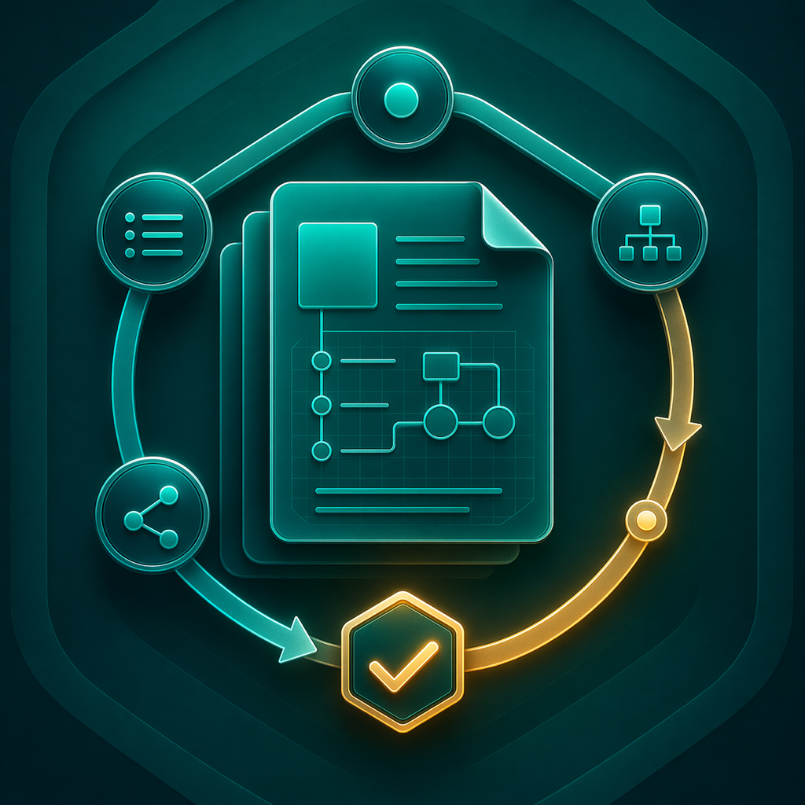

# Spec Skills

[中文 README](./README.md)



Spec Skills is a Spec-Driven Development plugin for Codex. The goal is not to ship a loose collection of prompts, but to provide a reusable execution workflow across proposal, spec creation, implementation, review, fixing, and archiving.

This repository is now structured as a standard Codex marketplace source:

- the repository root is the marketplace root
- the plugin lives in `plugins/spec-skills/`
- the marketplace index lives in `.agents/plugins/marketplace.json`

That gives consumers two supported ways to use it: add the repository as a marketplace source, or point Codex directly at the plugin directory.

## Repository Structure

```txt
codex-sdd-plugin/
├── .agents/plugins/marketplace.json
├── plugins/spec-skills/
│   ├── .codex-plugin/plugin.json
│   ├── skills/
│   └── references/
├── README.md
└── README.en.md
```

Important files:

- marketplace index: [.agents/plugins/marketplace.json](./.agents/plugins/marketplace.json)
- plugin manifest: [plugins/spec-skills/.codex-plugin/plugin.json](./plugins/spec-skills/.codex-plugin/plugin.json)
- lifecycle reference: [plugins/spec-skills/references/full-sdd-lifecycle.md](./plugins/spec-skills/references/full-sdd-lifecycle.md)

## Using It in Codex

### Option 1: Add It as a Marketplace Source

This is now the recommended path.

Local directory:

```bash
git clone https://github.com/cKnight107/codex-sdd-plugin.git
codex marketplace add /path/to/codex-sdd-plugin
```

Git repository:

```bash
codex marketplace add https://github.com/cKnight107/codex-sdd-plugin.git
```

Codex will discover `spec-skills` through the root `.agents/plugins/marketplace.json`.

### Option 2: Load It as a Single Plugin Directory

If you do not want to use marketplace mode, point Codex directly at the plugin directory:

```bash
git clone https://github.com/cKnight107/codex-sdd-plugin.git
codex --plugin-dir /path/to/codex-sdd-plugin/plugins/spec-skills
```

The important detail is that the plugin directory is now `plugins/spec-skills`, not the repository root.

## Updating and Upgrading

These cases behave differently:

### 1. Direct local plugin directory usage

If a user points Codex at `plugins/spec-skills/`, the common flow is:

```bash
git pull
```

Then start a new Codex session. In practice that is usually enough to pick up the latest content.

### 2. Marketplace-installed or marketplace-enabled usage

Do not assume that repository changes automatically refresh the installed plugin. In the current Codex CLI, running `codex marketplace add ...` again usually only reports `already added` and does not refresh the local marketplace cache.

The safer update flow is to refresh the cached marketplace repository directly:

```bash
git -C ~/.codex/.tmp/marketplaces/spec-skills-marketplace pull
```

Then restart Codex Desktop, or at least start a new session.

If `pull` still does not pick up the update, do a hard refresh:

```bash
rm -rf ~/.codex/.tmp/marketplaces/spec-skills-marketplace
codex marketplace add https://github.com/cKnight107/codex-sdd-plugin.git
```

Codex caches marketplace repositories locally, so a stale cache can keep serving an older plugin revision. Plugin authors should also bump the plugin version on every release so users can verify that the update was actually picked up.

## Release Workflow

Use this minimum release process for reliable upgrades:

1. update files under `plugins/spec-skills/`
2. bump the `version` in [plugins/spec-skills/.codex-plugin/plugin.json](./plugins/spec-skills/.codex-plugin/plugin.json) for every release
3. commit and push the repository
4. note in the release or README whether consumers need to reinstall or re-enable the plugin

The plugin version has been bumped to `0.1.2` in this repository, and standard icon metadata has been added so UI refreshes can pick up the plugin icon correctly.

## What the Plugin Includes

The plugin currently includes:

- `7` lifecycle-stage skills: `spec-init`, `spec-propose`, `spec-create`, `spec-apply`, `spec-review`, `spec-fix`, `spec-archive`
- `21` foundational engineering skills for design, implementation, verification, review, and delivery
- one full lifecycle reference document for stage coordination

## Suggested Starting Prompts

- `Use $spec-init to initialize the spec directory and document skeleton for this repository`
- `Use $spec-propose to produce spec/tasks/log for this request, and do not code before confirmation`
- `Use $spec-apply to implement confirmed tasks one by one and sync verification evidence`
- `Use $spec-review to first check spec alignment, then run a quality review`
- `Use $spec-fix to apply incremental fixes based on review findings`
- `Use $spec-archive to archive the completed change and preserve long-term knowledge`

## Lifecycle Mapping

| Stage skill | User-facing action | Foundational skills used with it |
| --- | --- | --- |
| `spec-init` | Initialize the spec/document workspace | `documentation-and-adrs`, `context-engineering` |
| `spec-propose` | Clarify the request, analyze facts, and write the proposal | `idea-refine`, `spec-driven-development`, `planning-and-task-breakdown` |
| `spec-create` | Generate the structured spec template | `spec-driven-development` |
| `spec-apply` | Implement work from tasks | `incremental-implementation`, `test-driven-development`, `git-workflow-and-versioning` |
| `spec-review` | Run a two-phase review | `code-review-and-quality`, `security-and-hardening`, `performance-optimization` |
| `spec-fix` | Fix gaps found in review or validation | `debugging-and-error-recovery`, `test-driven-development`, `documentation-and-adrs` |
| `spec-archive` | Archive the change and preserve knowledge | `documentation-and-adrs`, `shipping-and-launch` |

See [plugins/spec-skills/references/full-sdd-lifecycle.md](./plugins/spec-skills/references/full-sdd-lifecycle.md) for the full collaboration rules.

## Acknowledgements

Thanks to [Addy Osmani](https://github.com/addyosmani) and the contributors of [agent-skills](https://github.com/addyosmani/agent-skills). This repository builds on the idea of turning engineering practices into executable skills, then narrows that idea into a Codex-oriented, document-driven workflow.

## License

This repository is released under the MIT License. Because parts of it evolved from `agent-skills`, this repository keeps attribution and license continuity for the upstream work.
